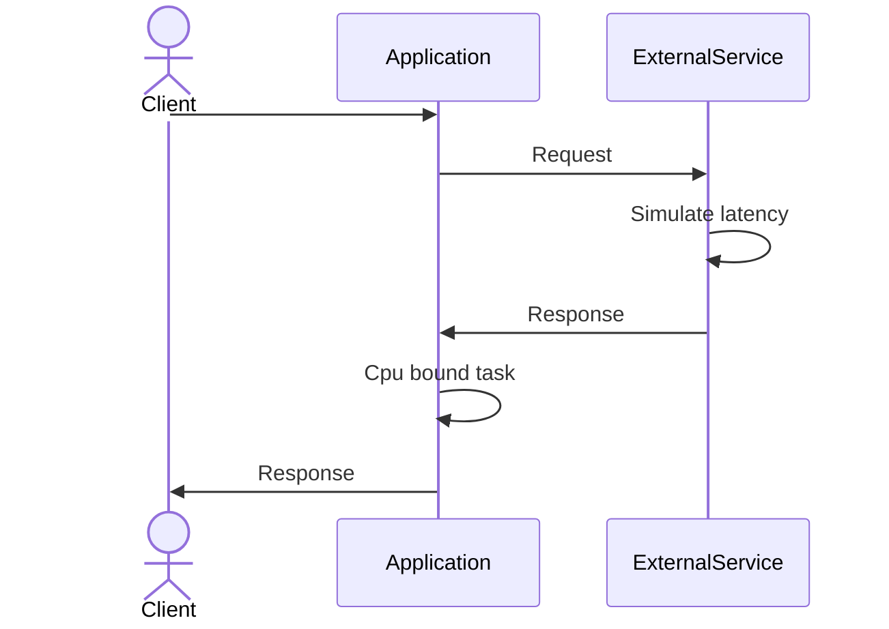
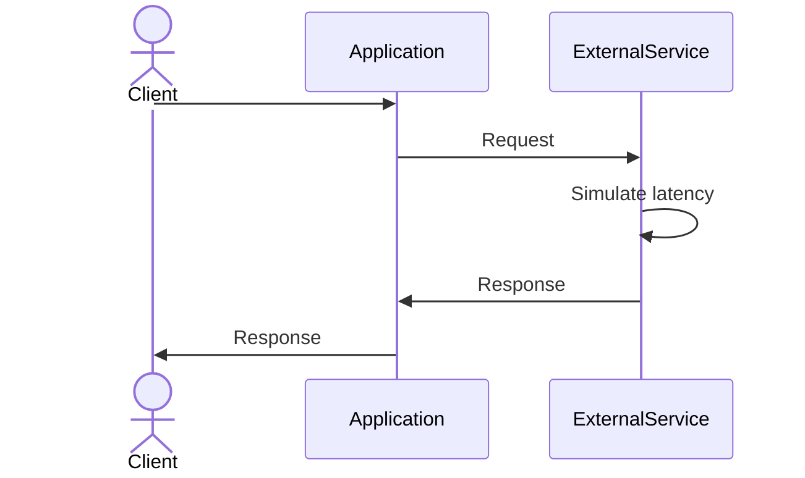
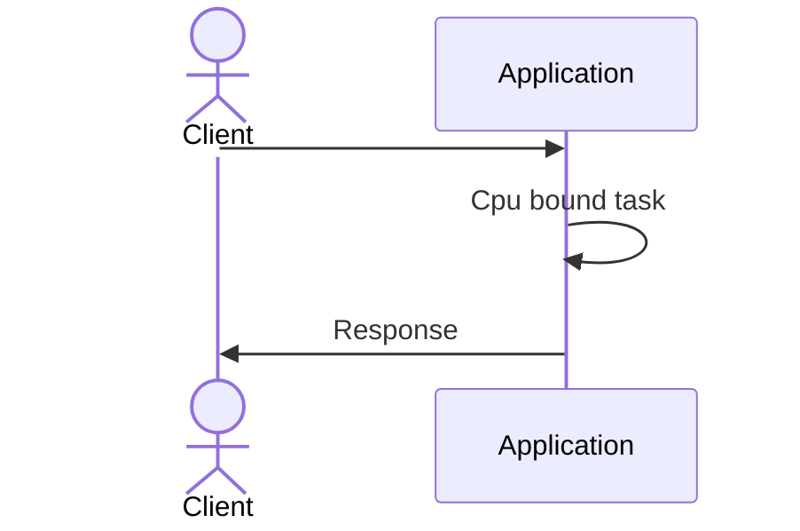

# Virtual thread performance benchmark

## About The Project

The project objective is to allow executing repeatable performance tests in different technical stacks and validate the performance of applications based on virtual threads. This project is mainly designed to be executed on an AWS account, however the stacks scenarios are developed and designed to run in Docker

## Results


See current results at our [Github Page](https://bancolombia.github.io/virtual-thread-performance-benchmark/)

## Getting Started

### Prerequisites

To run this project you need:

- `aws-cli` and an AWS account
- `jq` is a lightweight and flexible command-line JSON processor.[Download here](https://stedolan.github.io/jq/download/).

### Installation

1. Clone the repo
   ```sh
   git clone https://github.com/bancolombia/virtual-thread-performance-benchmark
   cd virtual-thread-performance-benchmark
   ```

2. Update your configuration in `config.json`   
   ```json
    {
        "StackName": "test-stack",                       # Prefix for test name
        "UrlReposity": "https://github.com/maocq/virtual-threads-benchmark-t",
        "VpcId": "vpc-0e4be5df9e95671aa",                # Your vcp
        "SubnetId": "subnet-01c7c6eb4150116c4",          # Your subnet
        "InstanceType": "c5.large",                      # AWS instance type
        "ImageId": "ami-0574da719dca65348",
        "User": "ubuntu",                                # Default user of the ami
        "KeyName": "johncarm-test",                      # Name of your key
        "Key": "/home/mao/mao/keys/johncarm-test.pem"    # Location of your key
    }
   ```

## Usage

In the start_all.sh script you can change the stacks array what you want to run, this script will run the start.sh script with each stack.
The start.sh script will create three instances, the first will be the instance where the stack will be deployed, the second will be an instance with an external service that will simulate latency, and the third will be the performance instance.

The performance tool is the [distributed performance analyzer](https://github.com/bancolombia/distributed-performance-analyzer) project, also available as docker image at [dockerhub](https://hub.docker.com/repository/docker/bancolombia/distributed-performance-analyzer).

Then it will run every scenario on the stack and will download the results in the .tmp/results folder.

Run performance tests:

```shell
./start_all.sh
```

The following are the tested scenarios:

##### Case one



##### Case two



##### Case three



## License

Distributed under the MIT License. See `LICENSE` for more information.